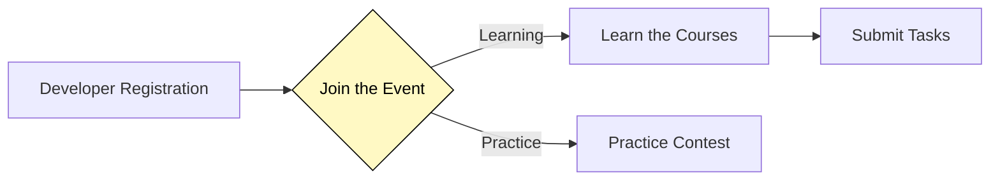

<!-- [中文](https://github.com/ArweaveOasis/Arweave-AO-Dev-Learning/blob/main/README_CN.md) / English -->

# School of DumDum

  

   Your one-stop journey to mastering Arweave AO development, organized by ArweaveOasis.
  

  

    
    
    
    
  

  

## Overview
The School of DumDum is a part of Arweave Academy developer education program. We offer developers free, high-quality courses and practical tasks to help them start building applications on Arweave and AO from scratch.  

Special thanks to [@K4y1s](https://x.com/K4y1s), [@sayestheorem](https://x.com/sayestheorem), [@rosmcmahon_real](https://x.com/rosmcmahon_real) and [@developer_dao](https://x.com/developer_dao) for support, and to [@OpenBuildxyz](https://x.com/OpenBuildxyz) for their guidance and assistance with the event process.

We divided this event into two parts: one for beginners and one for advanced developers.
- **Beginners** can enter the Learning section, where they will complete their learning by studying courses and submitting tasks.
- **Advanced Developers**, they can directly participate in the Practice section, which is a competition. You can choose a topic of your interest from the challange list and complete the practice by developing and writing tutorials. The best practices will be selected by judges and rewarded. 

The specific process is shown in the diagram below:

 

## Preparation
Before participating in the event, here’s what you need to prepare:
- Please prepare your AR wallet -- [Arconnect](https://www.arconnect.io/)
- An all-in-one Arweave AO relevant documentation list -- [awesome-ao](https://github.com/ArweaveOasis/awesome-ao)
- Arweave block explorer -- [viewblock](https://viewblock.io/arweave)
- AO explorer -- [aolink](https://www.ao.link/)

 

## Registration
Developers need to complete GitHub registration by following these steps:

1. `Star` and `Fork` this repository and `clone` it to your local.
2. Navigate to the `submissions` folder and create a new folder named after your GitHub username: `YourName`.
3. Copy the [Template.md](./template.md) file into the newly created folder and rename it to your name: `YourName.md`.
4. Open the `submissions/YourName/YourName.md` file, fill in your information as instructed, and save it.
5. Submit a `PR` to this repository. Once your PR is merged, your GitHub registration is complete. 

   👉 Here is the tutorial about [How to Submitting a PR on Github](./doc/How%20to%20Submitting%20a%20PR%20on%20Github.md)
6. After you complete the registration process, please join in the [Discord channel](https://discord.gg/Z7R7Az6T).

 

## Task Submission
After each course, there will be a series of tasks. These tasks are the primary way to assess whether you have mastered the course content. 

For example, to submit `task1`, follow these steps:

1. Create a `task1` folder under `submissions/YourName`.
2. Copy the [task1.md](./task/task1.md) file into your `task1` folder. You can also create a `readme.md` file to organize your task content. (Submission of learning notes and reflections is encouraged.)
3. Answer all the questions in the tasks and fill in the answers in the table at the top of the file.
4. Submit a `PR` (Pull Request) to this repository. Once the `PR` is merged, `task1` will be considered complete.
5. ⚠️ Each **Task** must be submitted separately. A single `PR` containing multiple **Tasks** will be closed directly.

Developers who complete all the courses and submit the tasks will receive a Level 1 Certification. If you earn all 4 Levels of Certifications in the future, you will be awarded a **Final Graduation Certificate** and become a priority candidate in our talent pool, gaining access to more job opportunities within the ecosystem.

 

## Course Guideline
### Level 1 Introduction to Arweave and AO
**Module 1: Understanding Arweave**

1. Intro to Arweave | [Learn](https://academy.developerdao.com/tracks/arweave-101/1)
    - What is Arweave?
    - How does Arweave Work?
    - Permanent Storage Through Consensus and The Endowment
    - Arweave Transactions
    - Smart Contracts as Add-Ons

2. Storing Data on Arweave | [Learn](https://academy.developerdao.com/tracks/arweave-101/3)
    - How to Store Small Files on Arweave?
    - What are Popular Arweave Bundling Services and SDKs?
    - What are Popular Arweave Wallets?

3. Why should developers care about Arweave？| [Learn]()

| Task | Topic | Status |
|-------|-------|-------|
| [task1](./task/task1.md) | 6 Quizs for "Intro to Arweave" | Not Start |
| [task2](./task/task2.md) | 8 Quizs for "Intro to Arweave" | Not Start | 
| [task3](./task/task3.md) | 9 Quizs for "Storing Data on Arweave" | Not Start |

 

**Module 2: Basic development on Arweave**

1. Access Data on Arweave | [Learn](https://academy.developerdao.com/tracks/arweave-101/2)
    - How to Access Files on Arweave?
    - How to Access Directories on Arweave?
    - How to Find Files on Arweave With GraphQL?
    - How to Find Files on Arweave With Subdomains?

2. Building a static website on Arweave | [Learn](https://academy.developerdao.com/tracks/arweave-101/4)
    - Creating Your Website
    - Deploying Your Website to Arweave
    - Creating a Human-Friendly Name For Your Website

3. Build a Dapp on Arweave | [Learn](https://academy.developerdao.com/tracks/arweave-101/5)
    - Creating the DApp
    - Deploying the DApp
    - Creating a Human-Friendly Name for the DApp

| Task | Topic | Status |
|-------|-------|-------|
| [task4](./task/task4.md) | 6 Quizs for "Access Data on Arweave" | Not Start |
| [task5](./task/task5.md) | 6 Quizs for "Access Data on Arweave" | Not Start | 
| [task6](./task/task6.md) | 6 Quizs for "Building a static website on Arweave" | Not Start |
| [task7](./task/task7.md) | 6 Quizs for "Building a static website on Arweave" | Not Start |
| [task8](./task/task8.md) | 6 Quizs for "Build a Dapp on Arweave" | Not Start |
| [task9](./task/task9.md) | 6 Quizs for "Build a Dapp on Arweave" | Not Start |
| [task10](./task/task10.md) | 6 Quizs for "Build a Dapp on Arweave" | Not Start |

 

**Module 3: Introduction to AO (TBD)**  
**Module 4: Connecting Arweave and AO (TBD)**

 

## Practice
The Practice section is designed for advanced developers. If you have extensive development experience, why not give it a try?

We will continuously release Practice challenges, and for each challenge, a Best Practice will be selected and merged to the [awesome-ao](https://github.com/ArweaveOasis/awesome-ao) repo. The winner will receive rewards sponsored by Forward Research.

How to submit the challenge:
1. Create a `challenge1` folder under `submissions/YourName`.
2. Copy the [challenge1.md](./practice/challenge1.md) file into your `challenge1` folder. You can also create a `readme.md` file to give an introduction about your code. 
3. Submit a `PR` (Pull Request) to this repository. 
4. ⚠️ Each **Challenge** must be submitted separately. A single `PR` containing multiple **Challenges** will be closed directly.

| Challenge | Type | Tag | Topic | Reward | Status |
|-------|--------|-------|-------|-------|-------|
|   1   | Frondend |  Arweave   | [File-based Routing](./practice/challenge1.md) | --- | --- |
|   2   | Frondend |  Arweave    | [Static Site Generation](./practice/challenge2.md) | --- | --- |
|   3   | Frondend |  Arweave   | [Client-Side Rendering](./practice/challenge3.md) | --- | --- |
|   4   | Frondend |  Arweave   | [Hash-Based SPA Routing](./practice/challenge4.md) | --- | --- |
 
