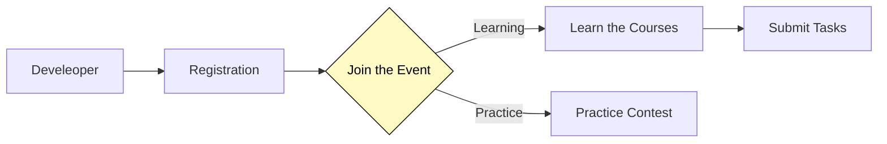

<!-- [中文](https://github.com/ArweaveOasis/Arweave-AO-Dev-Learning/blob/main/README_CN.md) / English -->

# School of DumDum

  

   Your one-stop journey to mastering Arweave AO development, organized by ArweaveOasis.
  

  

    
    
    
    
  

  

## Overview
This Arweave Academy is part of the developer education program's Level 1. We offer developers free, high-quality courses and practical tasks to help them start building applications on Arweave and AO from scratch.

After completing the learning program, capable developers can participate in the Best Practices Contest, with Forward Research supporting a XXXX reward for the winner.

We divided this event into two parts: one for beginners and one for advanced developers.
- Developers who are new to the Arweave and AO ecosystems can enter the Learning section, where they will complete their learning by studying courses and submitting tasks.
- For advanced developers, they can directly participate in the Practice section, which is a competition. You can choose a topic of your interest from the challange list and complete the practice by developing and writing tutorials. The best practices will be selected by judges and rewarded. 

The specific process is shown in the diagram below:

 

## Preparation
- Please prepare your AR wallet -- [Arconnect](https://www.arconnect.io/)
- An all-in-one Arweave AO relevant documentation list -- [awesome-ao](https://github.com/ArweaveOasis/awesome-ao)
- Arweave block explorer -- [viewblock](https://viewblock.io/arweave)
- AO explorer -- [aolink](https://www.ao.link/)

 

## Registration
Developers need to complete GitHub registration by following these steps:

1. `star` and `Fork` this repository and `clone` it to your local.
2. Navigate to the `submissions` folder and create a new folder named after your GitHub username: `YourName`.
3. Copy the [Template.md](./template.md) file into the newly created folder and rename it to your name: `YourName.md`.
4. Open the `submissions/YourName/YourName.md` file, fill in your information as instructed, and save it.
5. Submit a `PR` to this repository. Once your PR is merged, your GitHub registration is complete. | [How to Submitting a PR on Github](./doc/How%20to%20Submitting%20a%20PR%20on%20Github.md)
6. After you complete the registration process, please join in the [Discord channel](https://discord.gg/U5qjMKpu).

 

## Course Guideline
The specific course details will be announced on **January 6, 2025**.

 

## Task Submission
This course will be conducted with one module per week, and each module has 1-2 tasks. Check the task list [here](#tasks). To submit `task1`, follow these steps:

1. Create a `task1` folder under `submissions/YourName`.
2. Place your task files inside the `task1` folder. You can also create a `readme.md` file to organize your task content. (Submission of learning notes and reflections is encouraged.)
3. Submit a `PR` (Pull Request) to this repository. Once the `PR` is merged, `task1` will be considered complete.

⚠️ Each **Task** must be submitted separately. A single `PR` containing multiple **Tasks** will be closed directly.

 

## Tasks
Developers who complete all the courses and submit the tasks for this session will receive a Level 1 NFT. If you collect all 4 Levels of NFTs in the future, you will be awarded a final graduation certificate and become a priority candidate in our talent pool, gaining access to more ecosystem job opportunities.
| Task | Phase | Topic | Reward | Status |
|-------|-------|-------|-------|-------|
| [task1](./task/task1.md) | Week 1 | --- | NFT | Preparing |
| [task2](./task/task2.md) | Week 2 | --- | NFT | Preparing | 
| [task3](./task/task3.md) | Week 3 | --- | NFT | Preparing |
| [task4](./task/task4.md) | Week 4 | --- | NFT | Preparing |

 