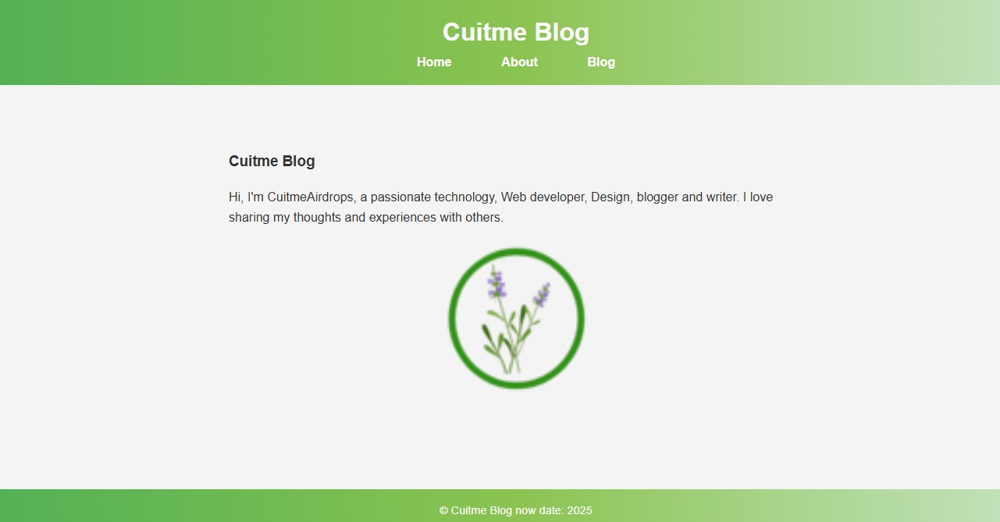
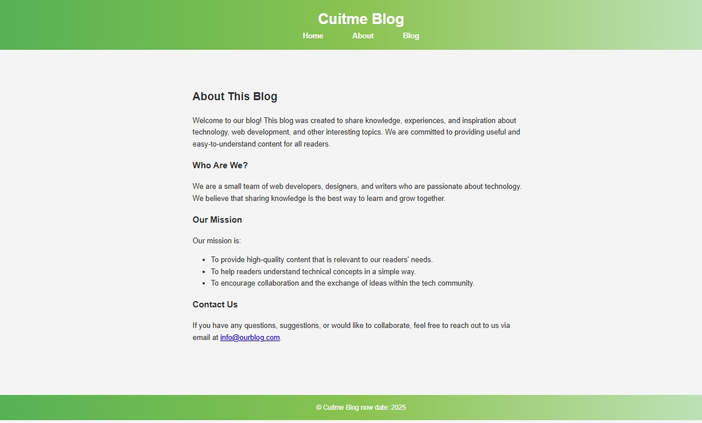
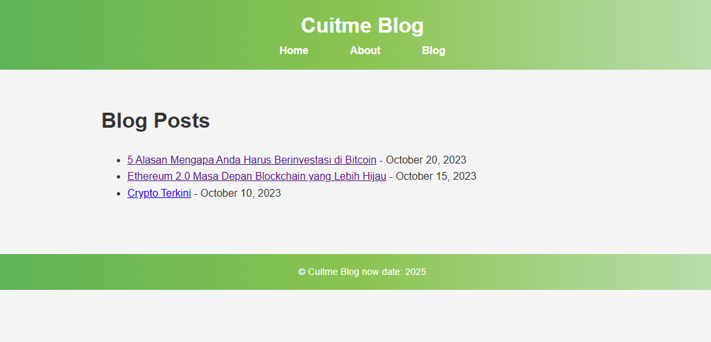

# Simple Blog

You can visit the website at:
[Cuitme Blog](https://arweave.developerdao.com/Xp9eyF9QwKVwuRTMxO65KmbWCnoSS6_jbx9GjD3bNTw)
[blog post](https://saaavtrkomt43rywy2hmqy4xjx66kfxb7eqdf6pcuvdoqigxfraa.arweave.developerdao.com/kAAKzipzJ83HFsaOyGOXTf3lFuH5IDL54qVG6CDXLEA?)
[about](https://mzpqtvp4sgeyyt2oxvkovuuyocwrhuubrt4buh5sppkvdvjvluka.arweave.developerdao.com/Zl8J1fyRiYxPTr1U6tKYcK0T0oGM-BofsnvVUdU1XRQ?)

## Screenshoot Run Local Site





## Project Description

**CUITME BLOG** is a decentralized blogging platform built on the **Arweave** blockchain. This blog stores content such as articles, images, and other media in a decentralized and permanent way. By utilizing Arweave, this blog ensures that all content is stored permanently, without the risk of data loss or server dependency. CUITME BLOG provides a unique experience of leveraging blockchain technology to publish and access content securely and immutably.

## Technologies Used

- **Arweave**: Permanent storage based on blockchain that ensures data remains safe and unalterable.
- **HTML/CSS/MD/NJK**: Technologies for web page structure and styling. Markdown (MD) is used for blog content, while Nunjucks (NJK) is used for dynamic templating.
- **JavaScript (Optional)**: Used for dynamic interactions on the page.
- **Manifest File**: A JSON file that describes the structure and files uploaded to Arweave, ensuring efficient file management and access.

## Getting Started

### 1. Prerequisites

Before getting started, make sure you have:

- An Arweave account with sufficient balance to upload files (use [Arweave Wallet](https://www.arweave.org/)).
- Node.js and npm installed (for project management if needed).
- Access to a text editor (like VSCode) to edit HTML, CSS, and Markdown files.

### Initialize and install the Project

```bash
mkdir <your-project-name>
cd <your-project-name>
npm init -y
npm install @11ty/eleventy
```

### 3. Set Up Project Structure

you can see structure project simple blog

- `src/css/style.css`: Styles for the website.
- `src/images/`: Contains images used in the website.
- `src/about.html`: About page.
- `src/post/`: Post page.
- `src/_includes/`: Layouts and reusable components.
- `src/_data/`: configuration website.
- `src/post/`: Post page source
- `dist/`: Output directory for the built site
- `index.html`: Home page.
- `.eleventy.js`: Eleventy configure file .
- `.package.json`: npm configure file.

### 4. Configure, Build and running Site

you can configure Eleventy project in .eleventy.js file :

Create `./eleventy.js`:

```javascript
module.exports = function (eleventyConfig) {
  return {
    dir: {
      input: "src",
      output: "dist",
      includes: "_includes",
      data: "_data",
    },
  };
};
```

Once the installation is complete, you can run Eleventy to generate the static site,

- **you can build the site**:

```bash
npm eleventy
```

This will generate the static site and save it in the \dist directory by default.

- **running project site local:**

```bash
npm eleventy --serve
```

The server will be available at http://localhost:8080/ by default.

### 5. Get Deployment URL

Before deploying, make sure your project is in the dist directory. After that, download or export the key.json from your Arweave wallet and rename it to key.json, Place the dist directory and the key.json file in the root directory from your project.

**Deploy**

```bash
node deploy-website.mjs
```

You will receive a URL and a manifest file.:

```arduino
https://arweave.net/<transaction-id>
```
