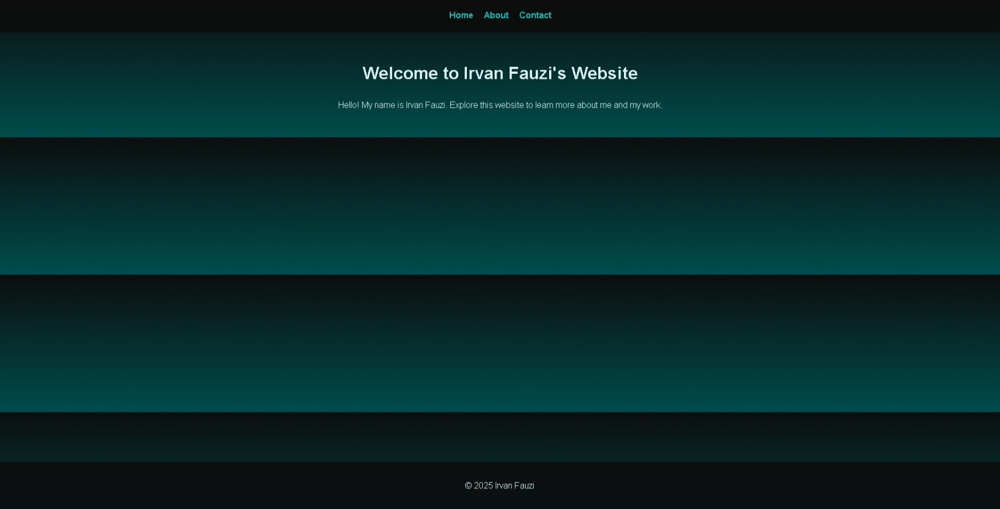
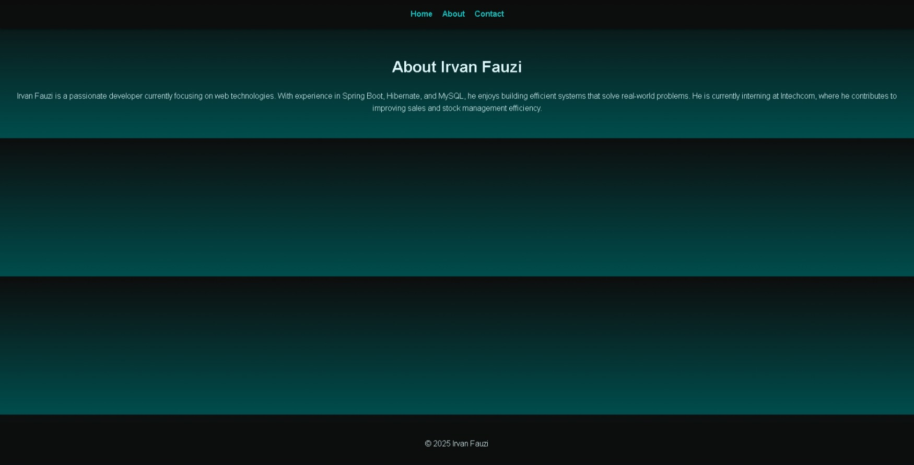
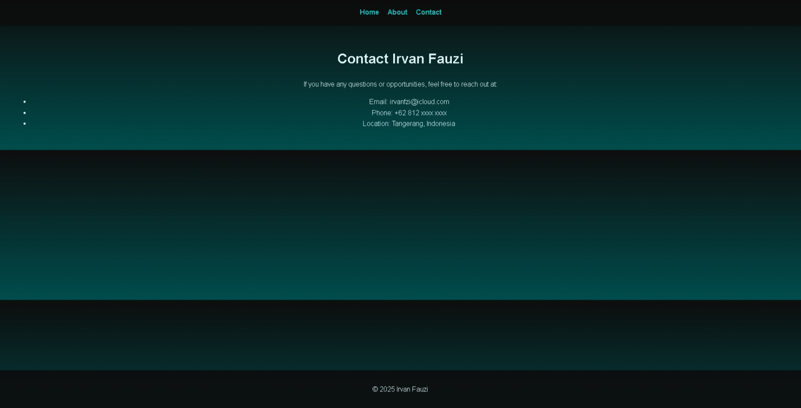

# Irvan Fauzi - Personal Website

This repository contains the source code for a simple personal website designed for **Irvan Fauzi**. The website includes multiple pages, file-based routing, and a responsive design with a modern dark gradient theme.

- [Arlink](https://arlink.arweave.net/) - Deployments on Arweave made as simple as one click.
- [Demo](https://challenge-1_arlink.arweave.net/) - This repository succes deploy on Arlink

## Features

- **Multi-Page Design**: Three interconnected HTML pages (`index.html`, `about.html`, `contact.html`).
- **Responsive Layout**: Optimized for both desktop and mobile devices.
- **Dark Gradient Theme**: Background transitions from dark to cyan.
- **Sticky Navigation**: Easy-to-access navigation menu.
- **Personalized Content**: Information about Irvan Fauzi's background, work, and contact details.

## Pages

1. **Home (index.html)**
   - Welcoming message.
   - Links to "About" and "Contact" pages.

2. **About (about.html)**
   - Brief description of Irvan Fauzi's skills and current internship.

3. **Contact (contact.html)**
   - Contact information including email, phone number, and location.

## Technologies Used

- **HTML**: Structure of the website.
- **CSS**: Styling and responsive design.

## Folder Structure

```
├── index.html       # Home page
├── about.html       # About page
├── contact.html     # Contact page
├── styles.css       # Styling for all pages
```

## Setup

1. Clone this repository:
   ```bash
   git clone <repository_url>
   ```
2. Navigate to the project folder:
   ```bash
   cd <project_folder>
   ```
3. Open `index.html` in your browser to view the website.

## Deploy on Arlink

1. Upload your project on github repository
2. see documentations here - [docs v1](https://arlink.gitbook.io/arlink-docs/getting-started/quickstart)

## Screenshots

### Home Page


### About Page


### Contact Page


## License

This project is open-source and available under the [MIT License](LICENSE).

---

**Created by [Irvan Fauzi](https://github.com/irvanfzi)**
