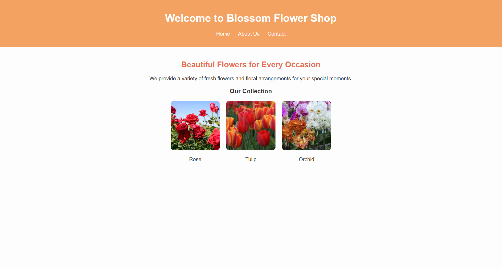
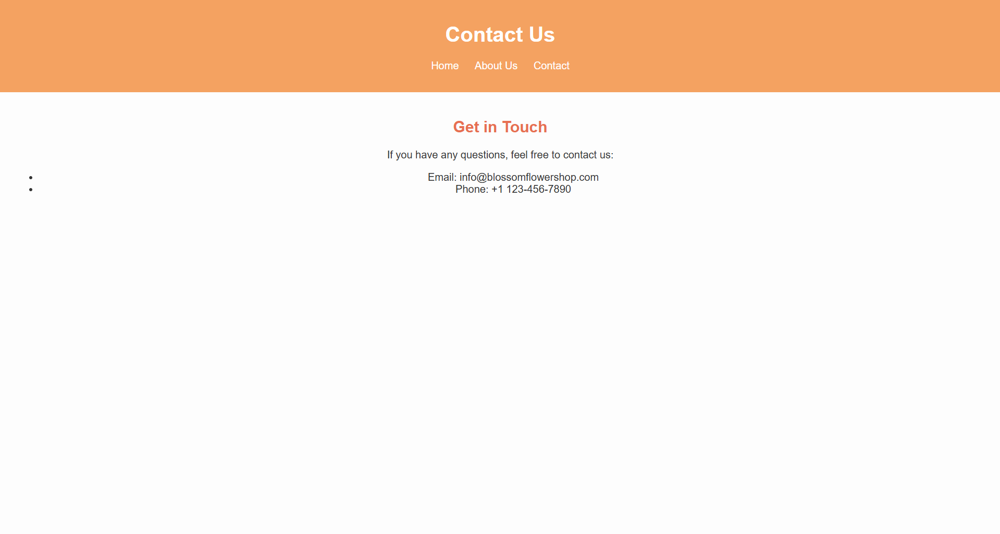

# Blossom Flower Shop Website

The website is deployed on Arweave using Dragondeploy. You can access it at [Deployed URL](https://arweave.net/28xGUdbaW0YlQV0CJ6D_dCjPTfiVjeSpCrdq-fRWdkk/).

## Description
This website project is a simple yet visually appealing website built with interconnected HTML files. The site is permanently hosted on Arweave, using DragonDeploy for smooth deployment.

## Files Structure

- `index.html`: Home page.
- `about.html`: About Us page.
- `contact.html`: Contact page.
- `assets/style.css`: Styles for the website.
- `assets/images/`: Contains images used in the website.

## Steps to Deploy Your Website

Start by visiting the [Dragondeploy](https://dragondeploy.xyz/) in your browser. Take a moment to explore the interface to ensure a smooth and efficient deployment experience.

### 1. Setting Up an Arweave Wallet

Before deploying, you'll need an Arweave wallet. Visit [arweave.app](https://arweave.app/) o create one. This wallet will enable you to interact with DragonDeploy and upload your website files seamlessly.

### 2. Connecting and Configuring Your Wallet

After connecting your Arweave wallet to DragonDeploy, consider adjusting the signTransaction setting in the permissions tab. Changing this from "Ask" to "Allow" can significantly speed up the uploading process, making it more convenient and user-friendly.

### 3. Uploading Your Files

Drag and drop your project folder directly into DragonDeploy. The platform uses a smart dispatch method to optimize file uploads to the Arweave network. Here are some key points:

- Files smaller than 100KB are uploaded free of charge.
- Larger files incur a cost based on Arweave's current network rates, with no hidden fees. DragonDeploy will display an estimated cost before the upload begins.

## Screenshots

