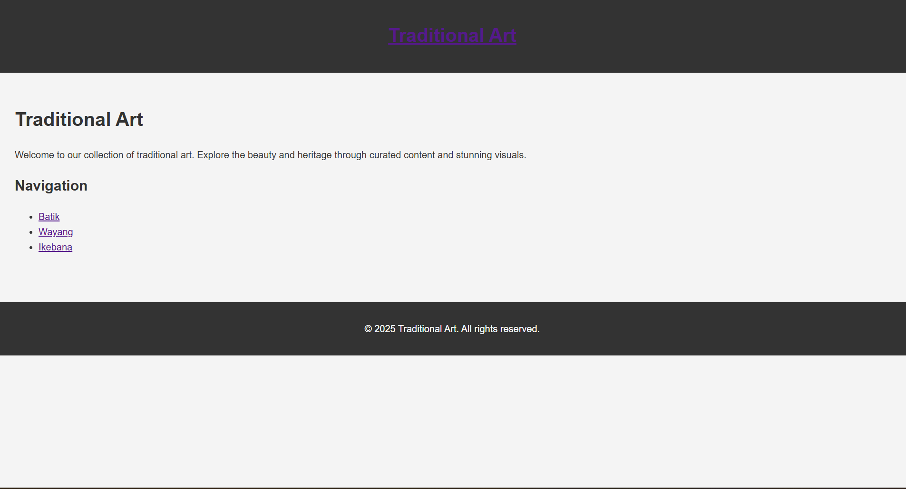
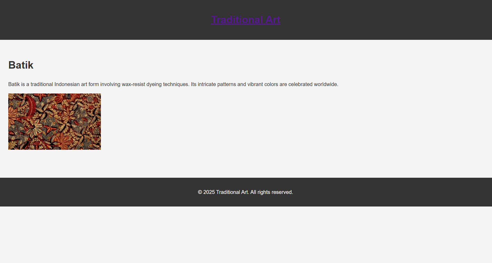

# Traditional Art Static Website with Eleventy

This project is a static website built using Eleventy (11ty) with a theme centered around traditional art.
The website is designed to showcase various forms of traditional art with visually appealing content and images. 
Finally, the site is deployed to Arweave using **Dragon Deploy** for permanent storage.


You can access it at [Deployed URL](https://arweave.net/rzLvtjTdPSWYEfDimQcDNSmEjEJxzSCe5O1xqXW7fME/).

---

## Features

- Built with **Eleventy**, a powerful static site generator.
- Responsive design with a focus on simplicity and aesthetics.
- Showcases different traditional art forms: Batik, Wayang, and Ikebana.
- Permanently stored on the **Arweave** blockchain using Dragon Deploy.

---

## Prerequisites

1. Node.js and npm installed on your system.
2. Basic knowledge of HTML, CSS, and Markdown.
3. An Arweave wallet for deployment.

---

## Steps to Build and Deploy Your Website

### 1. initialize a new Node.js project
```bash
npm init -y
```

### 2. Install Dependencies
```bash
npm install @11ty/eleventy --save-dev
```   
### 3. Set Up Project Structure

Create the necessary folder structure for your project:
```
traditional-art-site/
├── src/
│   ├── -includes
│   ├── batik.md
│   ├── wayang.md
│   ├── ikebana.md
│   ├── images/
│   │   ├── batik.jpg
│   │   ├── wayang.jpg
│   │   └── ikebana.jpg
│   ├── styles.css
│   └── index.md
├── .eleventy.js
├── package.json
└── README.md
```


### 4. Create Eleventy Configuration File

Create an .eleventy.js file in the root directory to configure Eleventy:
```bash
      
    module.exports = function (eleventyConfig) {
        // Copy assets to output folder
        eleventyConfig.addPassthroughCopy("src/images");
        eleventyConfig.addPassthroughCopy("src/styles.css");
      
        // Override permalink structure globally
        eleventyConfig.addCollection("allPages", function (collection) {
          return collection.getAll().map((item) => {
            if (item.outputPath && item.outputPath.endsWith("/index.html")) {
              item.data.permalink = item.outputPath.replace("/index.html", ".html");
            }
            return item;
          });
        });
      
        return {
          dir: {
            input: "src",
            output: "_site",
            includes: "_includes",
          },
          htmlTemplateEngine: "njk",
          markdownTemplateEngine: "njk",
          pathPrefix: "./",
        };
      };
      
  
  ```

### 5. Create Layouts

In the src/_includes folder, create the main layout base.njk:
```bash
<!DOCTYPE html>
<html lang="en">
<head>
    <meta charset="UTF-8">
    <meta name="viewport" content="width=device-width, initial-scale=1.0">
    <title>{{ title }}</title>
    <link rel="stylesheet" href="./styles.css">
</head>
<body>
    <header>
        <h1><a href="./">Traditional Art</a></h1>
    </header>
    <main>
        {{ content | safe }}
    </main>
    <footer>
        <p>&copy; 2025 Traditional Art. All rights reserved.</p>
    </footer>
</body>
</html>
```
### 6. Create Content Pages

Now, create the content for your portfolio website by adding markdown files in the src folder.

index.md:
```bash
---
layout: "base"
title: "Traditional Art"

---

# Traditional Art

Welcome to our collection of traditional art. Explore the beauty and heritage through curated content and stunning visuals.

## Navigation

- [Batik](./batik.html)
- [Wayang](./wayang.html)
- [Ikebana](./ikebana.html)
```
batik.md
```bash
---
layout: "base"
title: "Batik"
permalink: batik.html
---

# Batik

Batik is a traditional Indonesian art form involving wax-resist dyeing techniques. Its intricate patterns and vibrant colors are celebrated worldwide.


```
wayang.md
```bash
---
layout: "base"
title: "Wayang"
permalink: wayang.html
---

# Wayang

Wayang is a traditional puppet theater art form from Indonesia, showcasing stories from Hindu epics like Ramayana and Mahabharata.


```
ikebana.md
```bash
---
layout: "base"
title: "Ikebana"
permalink: ikebana.html
---

# Ikebana

Ikebana is the Japanese art of flower arrangement. It emphasizes harmony, balance, and the beauty of simplicity.


```
styles.css
```bash
body {
    font-family: Arial, sans-serif;
    line-height: 1.6;
    margin: 0;
    padding: 0;
    background: #f4f4f4;
    color: #333;
}

header {
    background: #333;
    color: #fff;
    padding: 1rem 0;
    text-align: center;
}

main {
    padding: 2rem;
}

footer {
    text-align: center;
    margin-top: 2rem;
    padding: 1rem;
    background: #333;
    color: #fff;
}

img {
    max-width: 100%;
    height: auto;
}
```
Add royalty-free images to the src/images folder:

- batik.jpg: A vibrant Batik pattern.

- wayang.jpg: A Wayang puppet.

- ikebana.jpg: An elegant Ikebana flower arrangement.

### 7. Build and Test

**Run the Development Server**
```bash
npx @11ty/eleventy --serve
```
Open *http://localhost:8080* in your browser to view the site.

**Build the Static Files**
```bash
npx @11ty/eleventy
```
The static files will be generated in the *_site* folder.

### 8. Deploy to Arweave

**Setting Up an Arweave Wallet**

- Before deploying, you'll need an Arweave wallet. Visit [arweave.app](https://arweave.app/) o create one. This wallet will enable you to interact with DragonDeploy and upload your website files seamlessly.

- After generating the static files with Eleventy, deploy them to Arweave. Here's how to do it:

- Navigate to the output folder _site containing the generated files.
- Use an Arweave deployment method, such as DragonDeploy or Arweave CLI, to upload your website.

**With DragonDeploy:**

- Visit [Dragondeploy](https://dragondeploy.xyz/).
- Connect your Arweave wallet (create one at arweave.app if you don't have it).
- Drag and drop the _site folder into DragonDeploy and follow the instructions to upload your site to Arweave.
- Files smaller than 100KB are uploaded free of charge.
- Larger files incur a cost based on Arweave's current network rates, with no hidden fees. DragonDeploy will display an estimated cost before the upload begins.

### 9. View Your Website

Once the website is deployed, it will be hosted permanently on Arweave. You can view the website by visiting the unique Arweave URL that is provided after the deployment.

You can access it at [Deployed URL](https://arweave.net/rzLvtjTdPSWYEfDimQcDNSmEjEJxzSCe5O1xqXW7fME/)

## Screenshots

**Home Page**


**Batik Page**


**Wayang Page**


**Ikebana Page**

