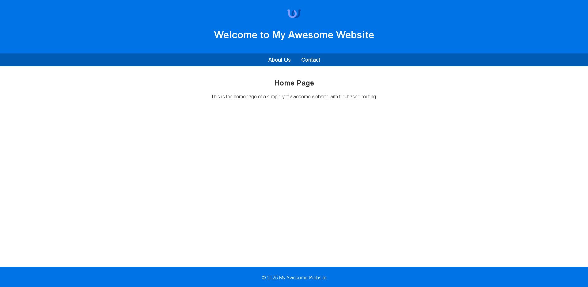
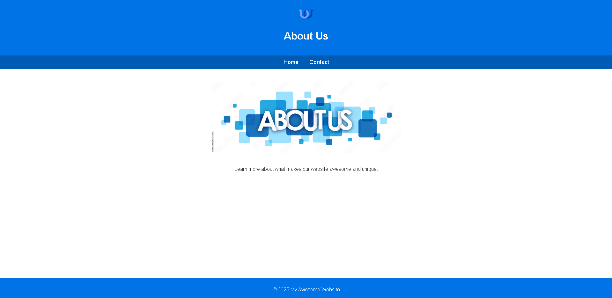
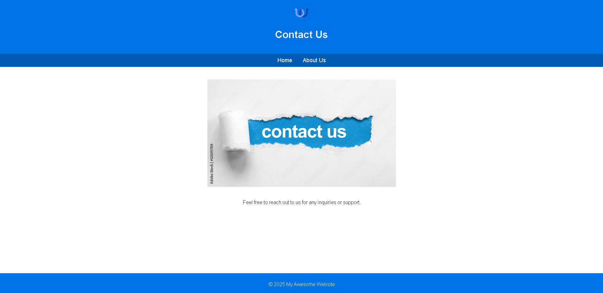

# My Awesome Website

The website is deployed on Arweave using Dragondeploy. You can access it at [Deployed URL](https://arweave.net/vlU3rx32-naFh-bqO8Wlo0F9S7fnV54r-NUXXIk4wnM/).

## Description
This project is a simple and visually appealing website with multiple HTML files that link to each other. It is deployed on Arweave using Dragondeploy.

## Files Included

- `index.html`: The homepage.
- `pages/about.html`: About Us page.
- `pages/contact.html`: Contact page.
- `assets/style.css`: Styles for the website.
- `assets/script.js`: Scripts for the website.
- `assets/images/`: Contains images used in the website.

## Deployment Steps

To begin, open [Dragondeploy](https://dragondeploy.xyz/) in your browser. Familiarize yourself with the interface to make the deployment process smoother.

### 1. Arweave.app

To use Dragondeploy you'll need an [arweave.app](https://arweave.app/) wallet. Head to the link, and generate a new wallet to get started using Dragondeploy.

### 2. The Upload Process

Once you have connected your arweave.app wallet to Dragondeploy, it is recommended to set signTransaction from Ask to Allow under the permissions tab. This will greatly increase the speed and experience of uploads on Dragondeploy.

### 3. Upload Costs

- All files are sent via the dispatch method, which finds the best way for your files to reach Arweave. It also means that files under 100KB are completely free!
- All other costs are subject to the price of the Arweave network, with no additional fees. Dragondeploy will give you an estimate of the upload cost when you drop in a folder.

## Screenshots

